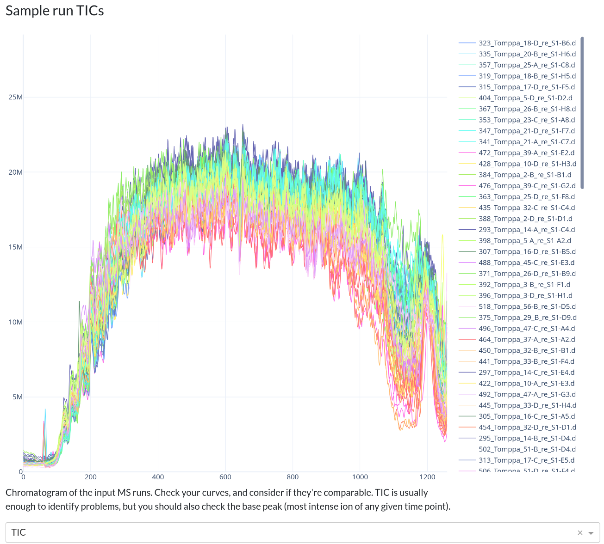
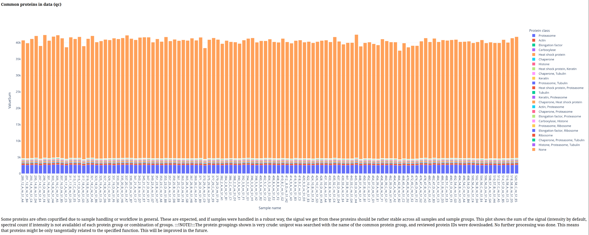
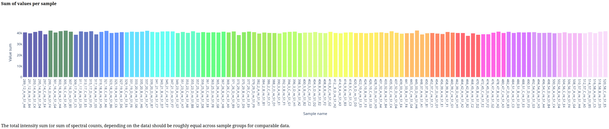
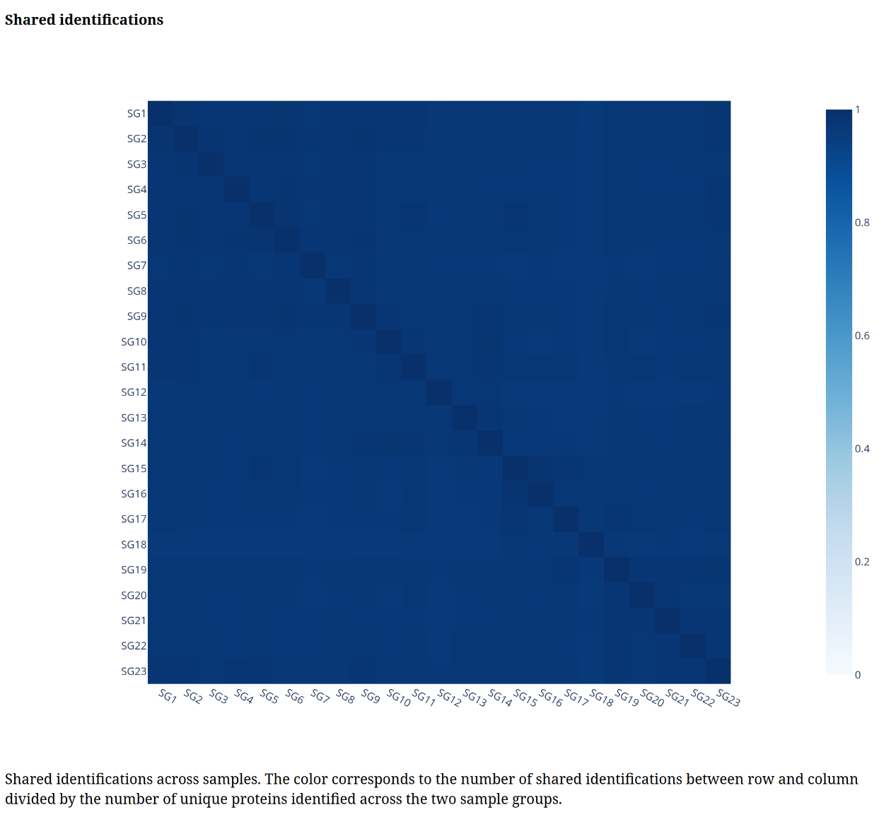
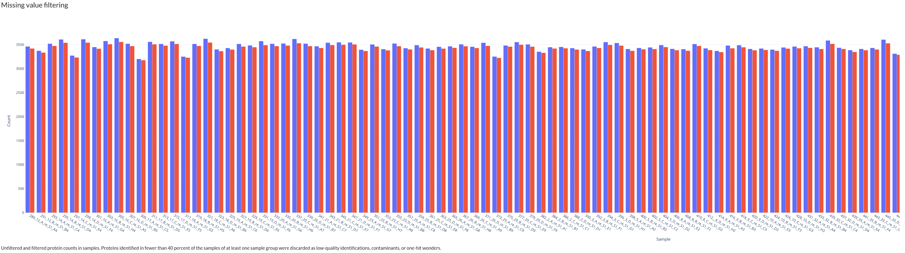
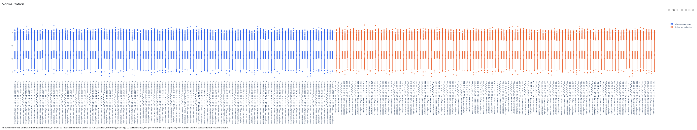
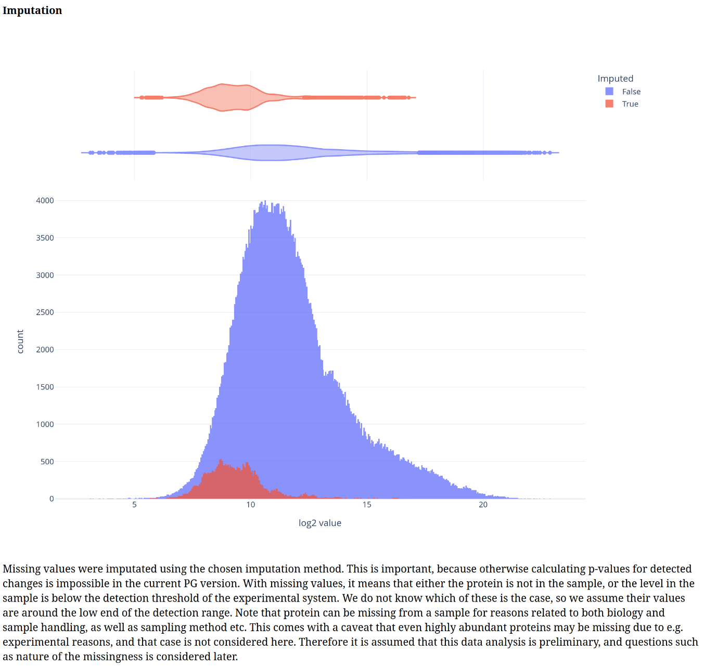
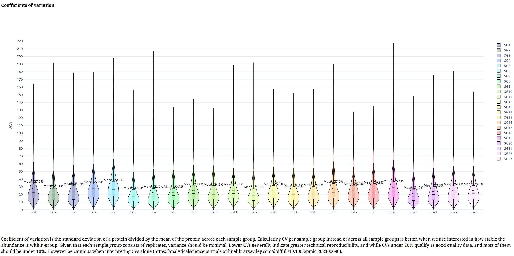

# Example usecases for ProteoGyver using public datasets
This guide documents the end to end QC analysis of a public proteomics dataset.

## Software and data utilized
Data for this example is from a dataset of a [previous publication](https://doi.org/10.1113/JP288104). The specific data used doesn't really matter, and here it's used only for illustrative purposes. Similarly, it is DIA data and as such, was searched with Dia-NN with default parameters and a generic human fasta library from UniProt. The results obtained are not optimal (for example Dia-NN parameters were not tuned based on MS method), but as long as something is identified, it is good enough.

## Proteogyver 
This example assumes you have proteogyver running in a docker container already. If not, refer to the main readme file for install instructions.

## Data upload

For data upload, the pg_matrix.tsv from the Dia-NN output was used as the data table, and for sample table, the sample runs were randomly divided into groups of 5. For sample table structure, please see either the interactomics example (sans the bait uniprot -column, or the [example files](../app/data/PG%20example%20files/). 

Proteomics was chosen from the workflow selection dropdown, and after pressing the "Begin analysis" -button, QC metric plots will begin to appear. After the QC plots have been generated, the proteomics input panel is presented:

From here, we relaxed the usual filtering to have at least some differences between the sample groups for later. For this example, we also chose the random forest based imputation algorithm. 

For proteomics workflow, those are the only inputs available. Afterwards, user is expected to inspect the plots to ensure data quality. 

Below is a gallery of all the generated plots. 

In addition, individual volcano plots for each comparison will be generated.