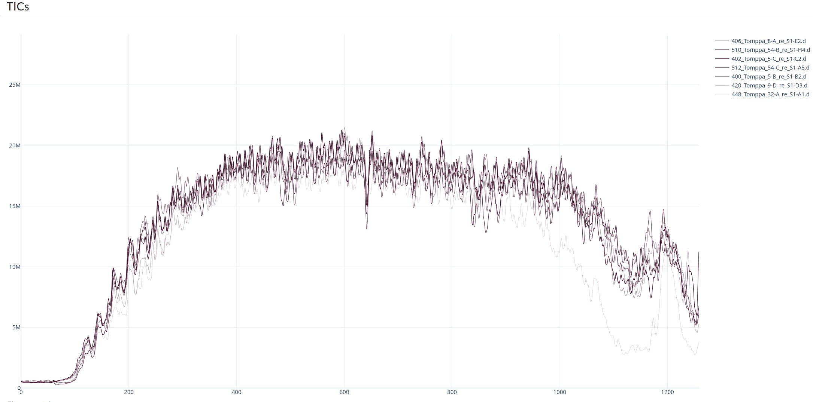
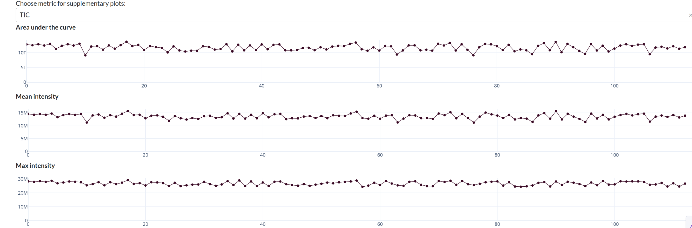
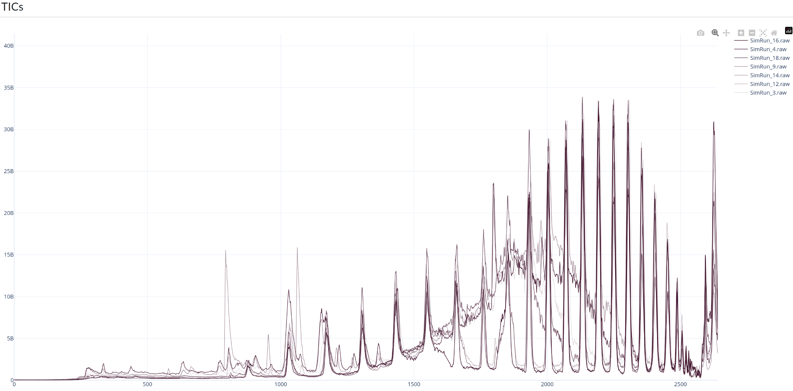
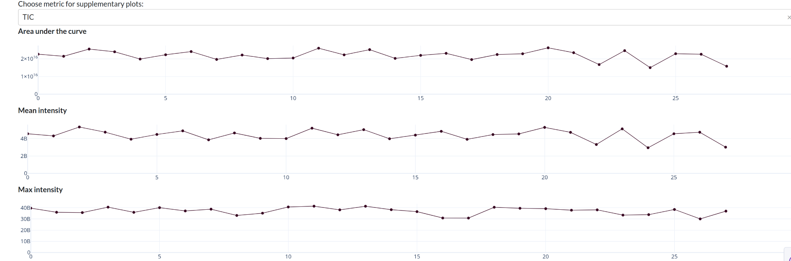
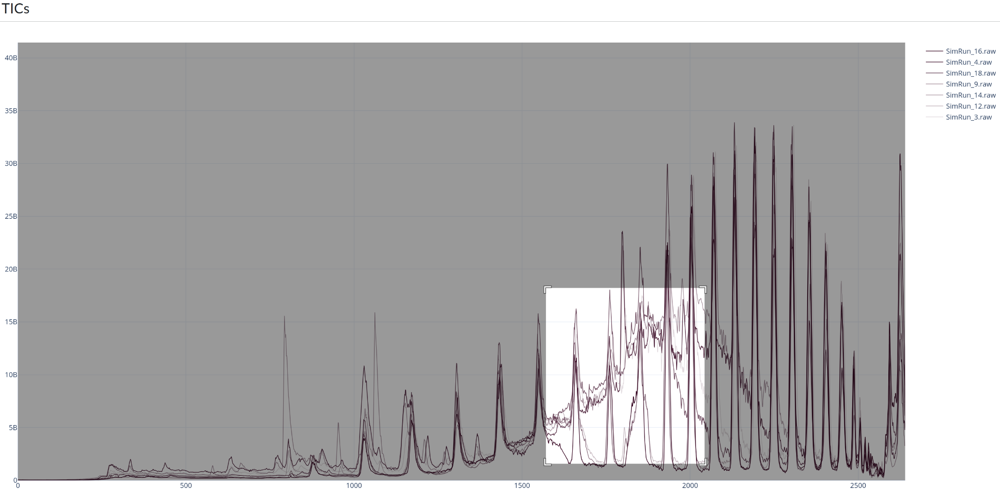
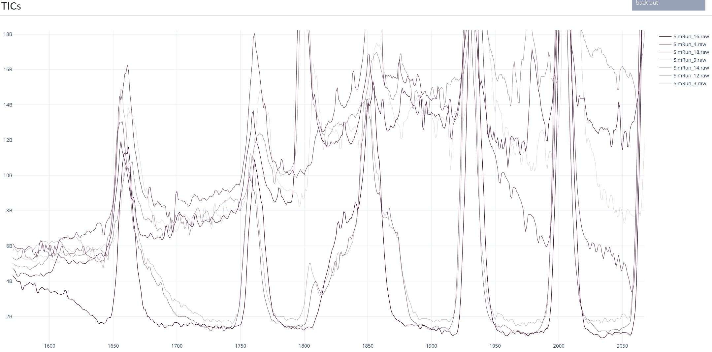
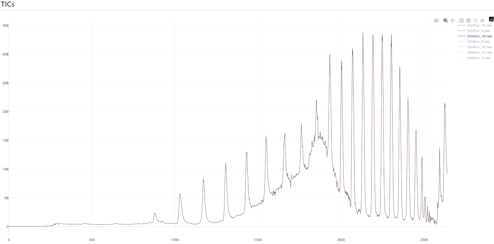

# Using MS-inspector to study problems in a sample set
For this exercise, we will use two sample sets: One published, good quality runs, and one with simulated data representing some potential problem in a sample set. In this case, detergent contamination. Sets of MS files for analysis are loaded by filtering the database using the dropdown etc on the left, e.g. only selecting runs from a time interval, or a specific instrument. We then click "Load runs by selected parameters" -button, and after a brief loading interval, MS inspector will start to display a live plot of the selected MS runs. If you press the loading button without filtering, MS inspector will grab 100 most recent MS runs.

For the good samples, we can see that the TIC curves are rouhly similar in shape and intensity over time:

And we can see that the AUC of the TIC, as well as max and mean intensities remain rather similar across the entire sample set:

However, when we inspect the bad sample set (simulated samples), we can detect e.g. low intensity across the board in the TIC, with highly intense, regular peaks suggesting detergent contamination:

Although in supplementary plots the AUC etc are relatively stable:

Similarly to most other plots, in MS inspector we can zoom in or select a region of a plot to inspect:

Double clicking will restore the view.

Or isolate a specific trace by double clicking on it (or single clicking on other traces to toggle them):

